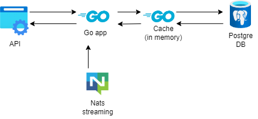

# Order stream
Приложение для быстрого получения и хранения заказов

## Запуск

```make docker``` - запускает базу дунных PG и очередь Nats streaming

```make run``` - запускает сервер

```make publisher``` - запускает клиент, с помощью которого можно записывать в очередь

## Архитектура



* Cache (in memory) - для кэширования частых запросов
* PostgreSQL - в роли БД
* Nats-streaming - брокер сообщений для получения заказов

Был использован подход чистой архитектуры так чтобы можно было легко заменять конкретные реализации, например легко заменить кэш или бд на Redis, a Nats streaming на что-то поновее).